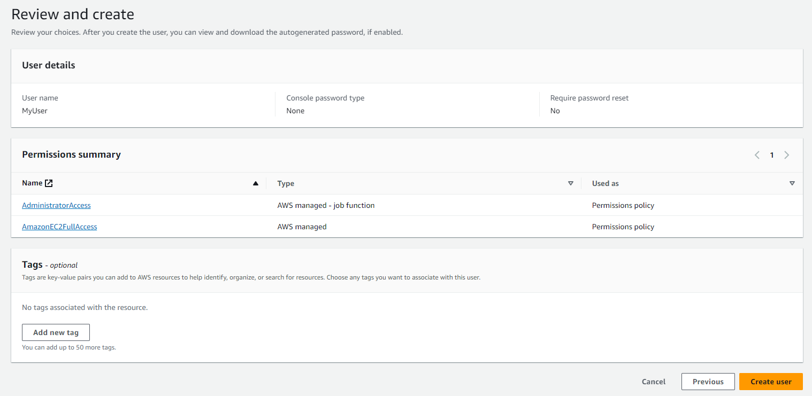
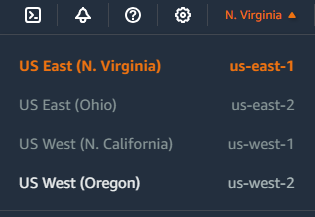
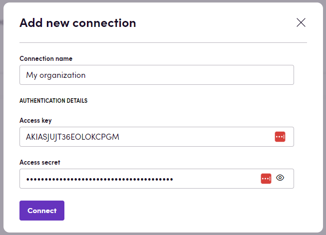

# Blackbird.io Amazon Bedrock

Blackbird is the new automation backbone for the language technology industry. Blackbird provides enterprise-scale automation and orchestration with a simple no-code/low-code platform. Blackbird enables ambitious organizations to identify, vet and automate as many processes as possible. Not just localization workflows, but any business and IT process. This repository represents an application that is deployable on Blackbird and usable inside the workflow editor.

## Introduction

<!-- begin docs -->

Amazon Bedrock is a fully managed service that offers a choice of high-performing foundation models from leading AI companies like AI21 Labs, Anthropic, Cohere, Stability AI, and Amazon with a single API, along with a broad set of capabilities you need to build generative AI applications, simplifying development while maintaining privacy and security.

## Before setting up

Before you can connect you need to make sure that:

- You have an [AWS root user account](https://docs.aws.amazon.com/IAM/latest/UserGuide/id_root-user.html) or [IAM user](https://docs.aws.amazon.com/IAM/latest/UserGuide/introduction_identity-management.html) created by root user for you.
- You have an access key and secret generated for your IAM user.
- You have access to models you want to use. You must request access to a model before you can use it. If you try to use the model before you have requested access to it, you receive an error.

### Create IAM user

- Go to [Identity and Access Management](https://console.aws.amazon.com/iamv2/home).
- Select _Users_ from the left sidebar.
- Click _Create user_.
- Enter _User name_ and click _Next_.
- Select _Attach policies directly_ option from _Permissions options_.
- Add _AdministratorAccess_ and _AmazonEC2FullAccess_ policies, then click _Next_.
- Review user details and permissions, then click _Create user_.

### Generate access key

- Go to [Identity and Access Management](https://console.aws.amazon.com/iamv2/home).
- Select _Users_ from the left sidebar.
- Select the user for whom you want to generate an access key.
- Go to the _Security credentials_ tab.
- Scroll down to the _Access keys_ section and click _Create access key_.
- Select _Use case_ and click _Next_.
- Enter _Description tag value_ and click _Create access key_.
- Save _Access key_ and _Secret access key_ values to be able to connect to Amazon Bedrock via Blackbird.

### Add model access

- Open the [Amazon Bedrock console](https://console.aws.amazon.com/bedrock).
- Change region to _US East (N. Virginia)_ in the top right corner.

- Select _Model access_ from the left sidebar and click _Edit_.
- Select the models you want to have access to and click _Save changes_.
- Models will show as _Access granted_ under _Access status_, if access is granted.

## Connecting

1. Navigate to apps and search for Amazon Bedrock. If you cannot find Amazon Bedrock then click _Add App_ in the top right corner, select Amazon Bedrock and add the app to your Blackbird environment.
2. Click _Add Connection_.
3. Name your connection for future reference e.g. 'My organization'.
4. Fill in the access key and secret obtained in the previous section.
5. Click _Connect_.
6. Confirm that the connection has appeared and the status is _Connected_.

## Actions

- **Generate image with Stability.ai Diffusion** generates text with Stability.ai Diffusion model or any custom model that is based on Stability.ai Diffusion model.
- **Generate text with AI21 Labs Jurassic-2** generates text with AI21 Labs Jurassic-2 model or any custom model that is based on AI21 Labs Jurassic-2 model.
- **Generate text with Meta Llama 2** generates text with Meta Llama 2 model or any custom model that is based on Meta Llama 2 model.
- **Generate text with Anthropic Claude** generates text with Anthropic Claude model or any custom model that is based on Anthropic Claude model.
- **Perform an LQA analysis with Anthropic Claude** uses pre-engineered prompt to conduct a Language Quality Assessment analysis of the translated text using the Anthropic Claude model.
- **Generate text with Cohere Command** generates text with Cohere Command model or any custom model that is based on Cohere Command model.
- **Generate text with Amazon Titan** generates text with Amazon Titan model or any custom model that is based on Amazon Titan model.
- **Generate embedding** generates embedding vector for a text provided. An embedding is a list of floating point numbers that captures semantic information about the text that it represents. Embeddings can be used to store data in vector databases (like Pinecone).

## Feedback

Do you want to use this app or do you have feedback on our implementation? Reach out to us using the [established channels](https://www.blackbird.io/) or create an issue.

<!-- end docs -->
